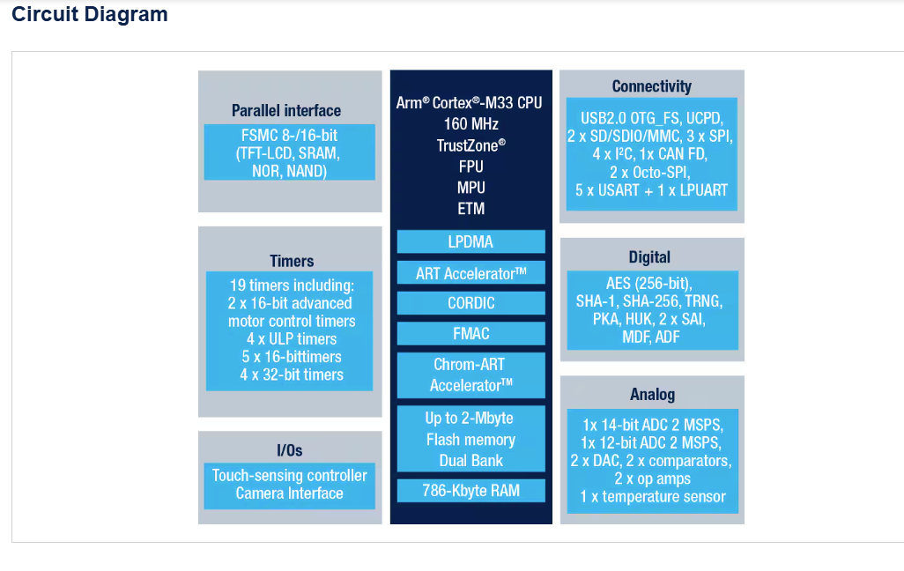
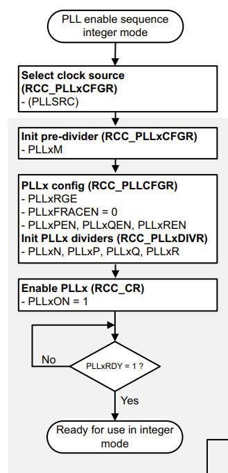
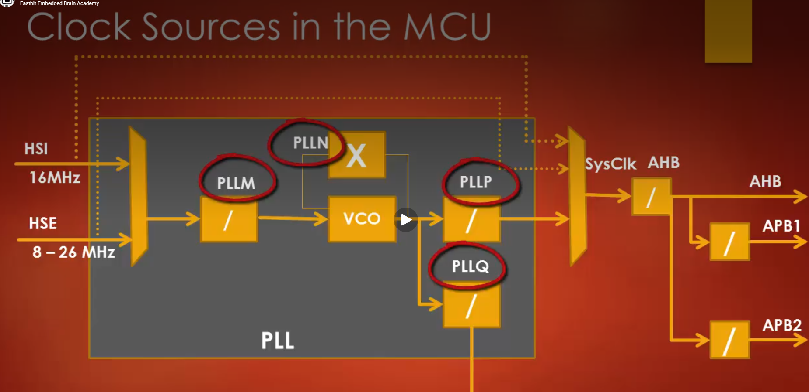
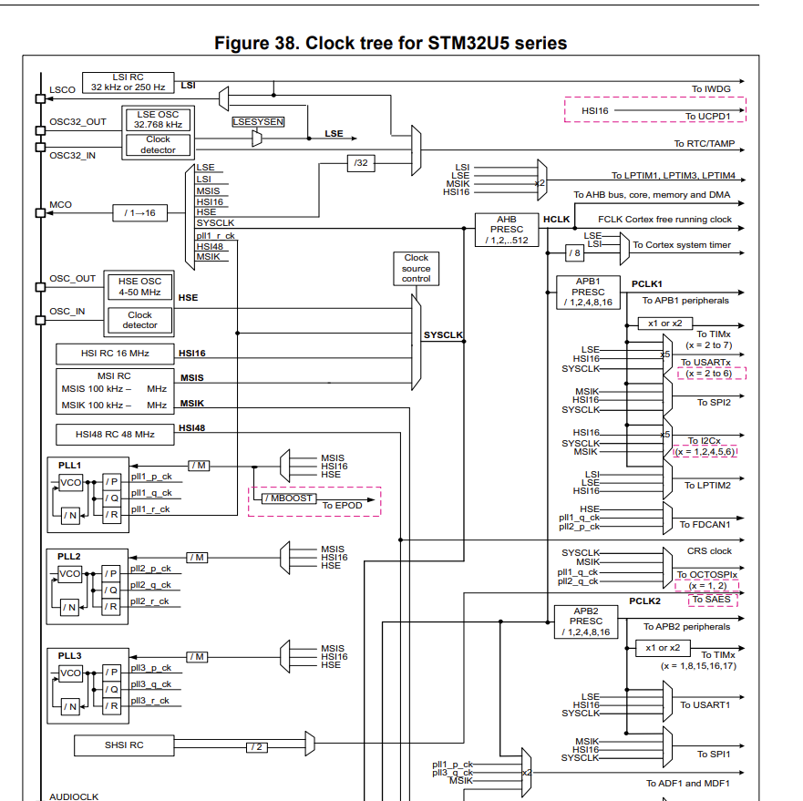
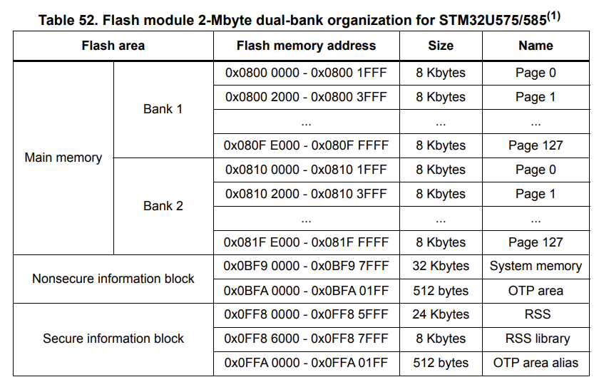
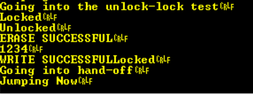
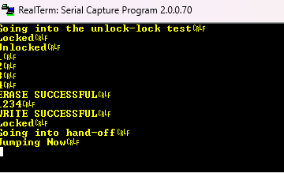
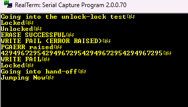
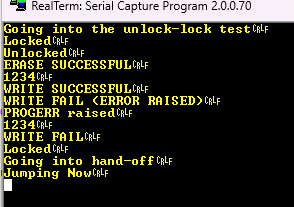

# Project 4: Secure Bootloader

_July 26, 2026, 8:02 PM_

## Let's start off with the bootloader project

Using:
- https://www.st.com/en/evaluation-tools/b-u585i-iot02a.html
- https://os.mbed.com/platforms/ST-Discovery-B-U585I-IOT02A/

Datasheet for the STM32U585:
- https://www.st.com/resource/en/datasheet/stm32u585ai.pdf

Reference Manual:
- https://www.st.com/resource/en/reference_manual/rm0456-stm32u5-series-armbased-32bit-mcus-stmicroelectronics.pdf

User Manual:
- https://www.st.com/resource/en/user_manual/um2839-discovery-kit-for-iot-node-with-stm32u5-series-stmicroelectronics.pdf



**MCU: STM32U585AI**

### Summary

Two independent security mechanisms that share a binary, plus an attack on our own work.

- Verified boot: answers the question, should I execute this image at all? We hash the app, check signature against a public key WE trust, and either jump or stop. After the jump, this mechanism is done.
- TrustZone-M: answers a different question for an entire runtime. NOW that trusted code is running, what is it allowed to touch? The hardware must be able to block non-secure apps from READING the key region at the bus level.

---

## Phase 0: Figure out how the system works

Get familiar with CubeIDE and the device I have. Blink an LED on it.

Where to plug in: CN8. This is the one we flash and debug from. Researched about the three plugins and this is the only one which allows us to do the natural flash/uart/debug out of the three.

CN8 goes straight to the ST-LINK debug chip which is somewhat a different mcu than the STM32U585 which we are using.

### GPIO on STM32 vs MSP

Ok so im used to the ONE-BIT system on msp. For stm32, we have a TWO-BIT system where each pin gets 2 bits (MODEy[1:0]).

- Pin 0 uses 0 and 1
- Pin 1 uses 2 and 3
- Pin 5 uses 10 and 11

In order to use these GPIOH_MODER things, we need to import the CMSIS header file like before.

### Let's do an LED run

LD6 and LD7 are PH6 and PH7 GPIO respectively.

1. Peripheral clock enable register 1 has a GPIOH enable bit (Bit 7).

Types of registers in this are different to what we're used to with the msp:
- Direction: GPIOx_MODER register (GPIO Port Mode Register)
- Push-pull vs open-drain: GPIOx_OTYPER
- Speed: GPIOx_OSPEEDR
- Internal pull-up/down: GPIOxPUPDR

Direction: 01 is the GP output Mode on the MODER register.

Doing it like this:

```c
GPIOH->MODER &= ~(3U << (PIN * 2));
GPIOH->MODER |= (1U << (PIN * 2));
```

We clear the two bits IN the pin first, then set it as 01 for output direction.

```c
REG &= ~(FIELD_MASK << (index * FIELD_WIDTH)); // clear
REG |= (VALUE << (index * FIELD_WIDTH));        // set
```

- FIELD_MASK: 4-bit means 0xF and 2-bit means 0x3 (2^width - 1)
- Index: Position of the field WITHIN the register
- FIELD_WIDTH: 4 or 2 or 1 or however much the width is
- Value: Value u need to write into it. Like for AF7, we need to write in 7 so we use 7U

The LEDs turn on when driven LOW and turn off when driven HIGH.

### GPIOx_ODR vs GPIOx_BSRR

- ODR: Output Data Register. This is a read/write register that stores the actual data to be output on the corresponding GPIO pins.
- BSRR (Bit Set/Reset Register): This is a 32-bit register designed to let you safely change individual bits in the ODR in a single one-shot operation without risking changing other pins.
  - Bits 0-15 (Bit Set): Writing a 1 to these lower bits forces the corresponding ODR bit to 1 HIGH.
  - Bits 16-31 (Bit Reset): Writing a 1 to these upper bits forces the ODR bit to 0 LOW.

So, to turn ON the LED, we write a 1 to the reset bits (BR6 and BR7) in the BSRR register. Note: Reset bits are in the upper half (16-31) so remember that bit 6 is now bit 22 and bit 7 is bit 23.

Ok so the LEDs blink and WE ARE GOOD TO GO.

I am now more familiar with this new device and its things, so let's get to reading.

---

## Let's do some UART now

USART: supports both synchronous and asynchronous modes. Uses a CLOCK.

- We have 3 of these in our MCU, so let's use them. USART1/2/3.
- Bit 14 of the RCC APB2 peripheral clock enable register (RCC_APB2ENR) needs to be set for clock enable.
- USART1_TX: PA9
- USART1_RX: PA10
- AF7 for both (alternate function)

So for the setting of AF7 PIN 9 and 10, we need to use the GPIO alternate function HIGH register called GPIOx_AFHL (pin 15 to 8). This includes AFSEL for pins 0 to 7.

- So every AFSEL has 4 bits. We need AF7 which is 0111.
- GPIOx->AFR[0] is low and AFR[1] is high.
- So we can write 0x00000770 to index 1 and it should be good (use |= ofc).

---

## PLL Setup

So /Core/Inc will include all the headers. Let's make a PLL one which just has a PLL init function.

My decision for 160MHz: boot time is small and power constraints would not matter as much for this time period. We can maximize our frequency.

Ok so, for a clock to actually function and register, there are THREE important factors:

- Power: What VCORE range do I need for this target frequency? DO I need a power booster?
- Memory (Flash): How many wait states does the flash memory need to safely execute code at this speed?
- Clock: how do I configure the clock source and PLL dividers to synthesize this exact speed?

The RCC has the main PLL called PLL1.

The PLLs are controlled via RCC_PLLxDIVR, RCC_PLLxFRACR, RCC_PLLxCFGR, and RCC_CR (x = 1, 2, 3). (pasted from RM pg. 493)

- Reduce power consumption -> configure VCOx output to the lowest frequency. VCO = voltage controlled oscillator.
- Input frequency = 4 to 16MHz (Frefx_ck)
- PLLxN loop divider works to give the expected frequency at VCO output.
- PLLxFRACEN is 0 -> integer mode.
- Enabled with PLLxON=1 in RCC_CR.

> The following PLL parameters cannot be changed once the PLL is enabled: PLLxN, PLLxRGE, PLLxP, PLLxQ, and PLLxR. To ensure an optimal behavior of the PLL when one of the post-dividers (PLLxP, PLLxQ, or PLLxR) is not used, the application must clear the enable bit (PLLxPEN, PLLxQEN, PLLxREN), and configure the corresponding post-dividers to their minimum value (PLLxR = 0, PLLxP = 0, or PLLxQ = 0). If the above rules are not respected, the PLL output frequency is not guaranteed. (RM pg. 494)

Integer mode, VCO frequency:
- Fvcox = Frefx_ck * PLLxN
- 320 = 16 * 20, PLLN=20, ref=16, fvco=320 (MHz)

So for this, we obv need to choose a number from the range of 128-544MHz for the VCO frequency.

A rule is: maximize the VCO frequency to MINIMIZE the PLL jitter, while choosing a value that is an EXACT multiple of the target output frequency (160MHz).

Initialization Phase:
- Initialize the PLLs registers according to the required frequency.
- Set PLLxFRACEN to 0 in RCC_PLL1CFGR.
- PLLxON=1, wait until PLLxRDY=1 (busy wait loop).

Flow as shown in the RM:



- 0x000000100
- We need to use HSI16 clock for PLL1 entry clock source (to match the 16MHz we decided earlier).
- PLL1P: Main System Clock. Route this.
- Ok so im having a bit of a hiccup so ill watch a yt vid: just not sure about the calculations so it's good to have a second look.



- Ok so this person targets a 168MHz clock OUTPUT.
- VCO boosts the frequency.
- Ok yeah this makes a lot more sense. Let's do the calcs again and see.

Redo the calcs:
- We don't need PLLQ for sure.
- We want SysClk to be 160MHz.
- We are using HSI for sure. Our VCO has a range of 128-544MHz.
- The input frequency range to VCO is 4-16MHz. So we can divide HSI by one and keep the VCO input the same as 16MHz.
- So PLLM=1.
- 16*20=320 which divided by 2 makes 160 which is what I want.
- Fref = 16MHz. VCO output is 320MHz. Sysclk is now 160MHz. PLLP is 2.



- Ok so I just figured out from this diagram that only the pll1_r_ck goes to the system clock. So all we need to do is swap the things we did for P with R and we good.

### Power for the 160MHz output

Next step for PLL is working with power. We need enough power for the 160MHz output to function properly.

Dynamic Voltage Scaling Management:
- Increasing/decreasing voltage used for Vcore according to the application performance and power consumption needs.
- Dynamic voltage scaling to increase Vcore is overvolting, opposite is undervolting which is used to save power in stuff like phones and laptops.
- We need Range 1L high output voltage at 1.2V. Used when the sysclk f is upto 160MHz which it is for us.
- Section 10.5.4 page 410 has a map for setting this voltage. Let's get to the flow. I will code using the flow, then check back in with the flow and notes on what happened during the process.

Notes for the voltage scaling settings:
- PLL1MBOOST is the prescalar for EPOD booster input clock. Configures the prescalar of the PLL1, used for the EPOD booster. The EPOD booster input frequency is: PLL1 input clock frequency / PLL1MBOOST.
- Important note on the BOOST stuff: it can only be written when the PLL1 is disabled (PLL1ON=0 and PLL1RDY=0).
- We need to do PLL1MBOOST=0000 because we need 16MHz/1 = 16MHz.
- In order to clear those bits, we first need to make sure that the PLL1 is disabled and the EPODBoost mode is disabled in the PWR_VOSR (power voltage scaling register).
- Just learned something new: In order to use a clock source, one must TURN IT ON before selecting it for the PLL.

### Wait States

Ok just got stuck on Wait States:
- The reason we need wait states is because at times memory cant return data in one cycle. We need wait states to transfer it in the next data cycle.
- The number of wait states is related to the HCLK frequency and the flash's extra time.
- So we need to find a value which says that for this voltage range, for this HCLK band, use this many wait states.
- Found the table, so we need 0 wait states.

Ok while programming, I came across a better difference definition for Flash memory and SRAM:
- Flash Memory: non-volatile. Uses floating-gate transistors which are physically slower to read. At 160MHz, a CPU cycle is only 6.25ns which requires a 4-wait-state pause (from table 54. on chapter 7.3.3 page 295 of the RM).
- SRAM: volatile and integrated on the high-speed CPU bus matrix. Incredibly fast and operates at true CPU core speed. Therefore, it needs 0 wait states.

### Switch the system clock

- Now all that is left is switching the system clock to the PLL r.
- This can be done from the RCC_CFGR1 register.
- DONEEEEE

---

## USART programming

Now we need to program the usart for our specific message delivery use.
- Set the Baud Rate.
- Configure Stop bits.
- Configure Word Length (we can make it 8 bits and one stop bit).
- Enable the Peripheral AND the RX TX enable and Parity.

Baud Rate:
- Equation: Baud Rate = usart_ker_ck_pres / USARTDIV
- In the reset state where the USART's internal clock prescaler register is set to divide-by-1: usart_ker_ck_pres = System Clock Frequency.

Basic Steps I did:
1. Enable USART Clock.
2. Enable GPIO Port A Clock.
3. Make Port A Pins to AF mode using the MODER register.
4. Set the AFR Register indices to the required Afn number.

---

## Phase 1: Memory Map
 
Readings: FLASH memory from the RM (pg 291), Embedded Flash Memory from the Datasheet, Bank Boundary, Programming Granularity, and Write Alignment all from the RM.
 
### Flash memory notes (from Phase 1 reading)
 
- Flash Memory: non-volatile computer storage chip which can be electrically erased and reprogrammed in blocks.
- 4Mbytes of flash memory POSSIBLE but in our case we have 2MB of space (1MB per bank).


 
- To find how much space a page takes up, do 'end address - start address' + 1 (to include the 0th byte).
- This diagram explains that flash area has a Main memory, Bank 1, Bank 2, Non-secure info block, and a Secure info block.
- Flash erases a whole page at a time. We cannot erase specific parts of a page.
- MAIN FEATURES OF THE MEMORY:
  - Has a main memory (2MB) and two information blocks.
  - Bank 1: 128 pages, 8KB per page.
  - Bank 2: 128 pages, 8KB per page.
  - That means Bank 1 = Bank 2 = 128 pages * 8KB = 1MB per bank.
- Our read access latency is 5 CPU cycles (time taken to correctly read data from flash memory).
- So this can definitely work as a foundation for the A/B banks sections.
- So one firmware copy per bank, updating the inactive one while the active one runs. Then swap.
- Embedded Flash Memory: built directly into the MCU, different from standard flash. Our standard flash is 64MB (just saw the chip on the board). So it turns out we have 2MB of the fast internal flash memory coming from the mcu.
- Ok so it says we cannot read/write/erase the flash main memory during debug/boot from RAM/bootloader.
- Just learned one thing: our mcu has a flash memory of 2MB. So the 4MB number earlier is the MAX the stm32 family can hold in that case. Our mcu has 2MB.
- Bank 1 Boundary: 0x0800 0000 to 0x080F FFFF.
- Bank 2 Boundary: 0x0810 0000 to 0x081F FFFF.
- Sequences:
  - Flash memory is programmed at 137 bits at a time (128-bit data + 9 bits ECC).
  - Only possible to write quad-word (4x32 bit data).
  - Flash Memory programming sequence is given on page 300 of the RM.
  - 8 quad-words: Flash Burst Programming.
- Each memory page can be written and erased 10,000 or 100,000 times.
### A/B Scheme with bootloaders
 
- Uses two separate storage slots, slot A and B, to enable seamless and safe system updates. Such as active/inactive slot switching.
- Background updates.
- Automatic rollback.
### Bootloader theory (interrupt.memfault.com article)
 
Source: https://interrupt.memfault.com/blog/how-to-write-a-bootloader-from-scratch
 
- Need a bootloader to load the software.
- Look at the other two articles LINKED with this article as well which explain linker scripts and startup file to bootstrap the C environment.
- It lives in the Flash Memory.
- So we need to decide on how much space we want to dedicate to our bootloader.
- Flash sector size is important. We want to be able to erase app sectors without erasing bootloader data or vice versa. So, the bootloader must end on a flash sector boundary. This means that it would make use of the PAGES in flash memory as they are independently erased.
- Now, the next thing has to do with the Bank 1/2 split. We use a few pages in either bank for the bootloader. For the application slots, we can use the leftover pages from one bank (after the bootloader takes some space) and for the second bank, we can use the SAME leftover AMOUNT of memory. The same size, not the same memory. The leftover space can be used for other information.
- This 'other information' is the bootflags, update-in-progress states, version numbers, anti-rollback counters, etc.
- Then we transcribe the memory map into a linker script (we'll learn about it when writing the script).
- We need a valid stack pointer at 0x0 and a valid Reset_Handler function setting up our env at address 0x4.
### Boot process
 
Now looking at the first referenced article about the BOOT process. In short, a chip must do the following:
- Reset the vector table address to 0x00000000.
- Disable interrupts.
- Load the SP from address 0x00000000.
- Load the PC from address 0x00000004.
So, the main goal we have is to write a Reset_Handler which boots us to main (application). It is also responsible for initializing static and global variables and STARTING the program.
 
- All objects with static duration shall be initialized before program startup.
- Look at their Reset_Handler Code for better understanding (refer to it when writing the script and handler).
### Placing the bootloader
 
- So we need the bootloader to be the FIRST thing the CPU touches. We have decided how the banks and their memories are split, but their locations are still blurry. One thing Im thinking of is that if the bootloader needs to be first, then the bootloader must be placed at the START of Bank 1. So it is the first address.
- After researching more, I just learned that the STARTING location is not just by LAW the start of bank 1. They used the BOOT0 Pin, nBOOT0/nSWBOOT0 option bits, and specific boot address registers. Bank 1 physically maps to 0x0800 0000 (non-secure, aka trustzone is disabled). But this is the DEFAULT way the mcu is programmed. It is by default programmed to start at the start of bank 1.
- So the flow for this right now is: cpu wakes up, reads the initial stack pointer (SP) from the first 4 bytes of Bank 1, reads its Reset Vector from the next 4 bytes, and begins executing instructions right there.
### TrustZone considerations
 
Based on our initial plan, we will add the trustzone layer AFTER a successful secure verified boot bootloader has been built. So we start adding it in around phase 3. BUT, we need to keep trustzone in our minds when making the memory maps or planning some things out, even if we keep TZEN=0.
 
Secure vs non-secure alias:
- Secure (S): used for trusted execution, secure storage, and transition gates. Only available with trustzone.
- Non-secure (NS) alias: used for standard public execution and data storage. Used when TZEN=0. Remember that we cant access secure when TZEN=0 (it will result in hardfault).
- So let's make a memory map for the system and leave space for the TZEN=1 case (in both flash and ram).
### Memory Map design
 
- So we need the Flash and SRAM memory blocks for the bootloader.
- We already discussed the way im going to split up the bootloader space and Bank space, but now I need to figure out how the whole secure/non-secure memory is split.
- This makes more sense now that ive read those articles and did some more research on size allocations.
- We are allocating 32KB for the bootloader (4 pages) which is a safe starting point, as we might need less or more depending on the code. We write the code, CHECK the size it takes, then resize our memory map based on that. So we always start with a safe guess.
- The trustzone confusion we're facing right now can be resolved by just adding a little note to whether this ALLOCATED space will be secure or non-secure in the future when TrustZone is enabled.
- So bootloader goes from 0x0800_0000 to 0x0800_7FFF. This comes from 0x0800_0000 + 32KB = 0x0800_0000 + 0x8000 = 0x0800_8000 - 0x1 (to get the END address) = 0x0800_7FFF.
- Bank A will now run from the NEXT number (0x0800_8000) to the end of bank A (0x080F_FFFF).
- Bank B needs to be on the EXACT same memory space (different addresses).
- Starting address for Bank 2: 0x0810_0000.
- We add 32KB to it: 0x0810_8000 - 0x1 = 0x0810_7FFF. Now we run from 0x0810_8000 to the end 0x081F_FFFF for Bank B, and we have the symmetry and addresses lined up.
- So slot A and B are 992KB each.
- The flash has a same-bank read-while-write restriction rule. So, we keep the metadata in the second bank and keep the bootloader at the first.
- Now let's get this in table form:


 
---
 
## Linker Script
 
Now working on the linker script (using the pre-built one from stm32 which comes in the project folder, just need to edit it to ensure it matches my memory map).
 
- So it tells us WHICH memory regions exist and WHERE each chunk of your compiled code goes.
- ENTRY(Reset_Handler) tells the linker the program's entry symbol is Reset_Handler.
- _estack = ORIGIN(RAM) + LENGTH(RAM) and _sstack = _estack - _Min_Stack_Size.
- These are compute symbols for the STACK itself. _estack is the top of RAM (stack grows downward on ARM).
- So this ends up in the vector table as word 0.
- We can define a variable AFTER using it in .ld files.
- Linker script: acts as a blueprint of the entire memory layout. Defines available physical memory and maps program sections into those regions.
- LMA (Load Memory Address): where data is written at rest (Flash/ROM).
- VMA (Virtual Memory Address): where data/code lives and executes at runtime (RAM).
- In the existing .ld file, we make changes to the memory block which shows the memory split for RAM, SRAM, and Flash. Rwx is read, write, executable respectively.
- Every program (project) has one linker file which puts everything together and translates the binaries to output. Now, I initially thought that because the stm project folder gave me two linker scripts (RAM and FLASH), we need to work with BOTH at the same time and also make the same files for the bootloader, bank A/B, etc.
- HOWEVER, the two files are for two different build configurations of the same program. We work on the Flash for this project, so we use that linker script. Now the split: both slot A and slot B are parts of the APPLICATION. This means they get their own linker script. So, we make two linker scripts in total. Metadata does not need a linker script as it is not compiled code and does not need to be linked. The BOOTLOADER will refer to its address and read/write directly.
- So all I need to do is make the RAM size the same size as that of our bootloader. Remember that the RAM would be shared between the bootloader and app. RAM regions would matter when we get to that part.
The app is the LEDs blinking.
 
Checking the actual size used:
- Text + data = 2188 + 0 = 2188 Bytes = 2.137KB.
- So we have some headroom now.
Next step: make the application (separate file with its own linker script) which blinks the LED at a different (faster) rate than the bootloader app we have right now, just to ensure we are actually making the jump and it isnt just calling a function.
 
---
 
## Bootloader to Application Jump
 
Ok the new application project is set, we need to jump to it now.
 
- The hardware runs a tiny bootstrap sequence before any of our C executes. It reads from the vector table and uses that data to start running code.
- Basically, the hardware will jump to the bootloader using this sequence.
- Looking at the main article source (for theory of a bootloader): https://interrupt.memfault.com/blog/how-to-write-a-bootloader-from-scratch#setting-the-stage
- We need to make variables within the .ld file which we can reference in the bootloader.c file. We have two separate projects, so it wouldn't be as easy as they have done it, but we can use the same idea.
- Now remember when we pull a linker symbol into C, the symbol's VALUE becomes the address of the C symbol, not its contents. So refer to it using &.
- Note: we jump to the vector table FIRST, which pulls the initial stack pointer and the reset handler before any code runs. This links the hardware to the bootloader code which is then the first piece of code to be executed.
- The initial stack pointer sets the top of the stack. The reset handler points to the start of the bootloader code.
- Process:
  - The CPU reads the vector table (word 0 loads into the SP, word 1 loads into PC using resethandler).
  - Only THEN does execution begin.
  - Word 0: initial main stack pointer, the ACTUAL VALUE the SP should take on boot.
  - Word 1: reset vector, holds the ADDRESS of the reset handler function.
- VTOR: Vector Table Offset Register. Tells the CPU core where to find the active vector table.
### Sequence
 
- The CPU runs the bootloader using its mechanism (the same mechanism we would use, described below).
- In order for the CPU to jump to something like an app or a bootloader, it must read the vector table to know where to start.
- The vector table has two words the system would need for its work. Therefore, we need to get these elements to perfectly emulate what the hardware did and what the system fetched on a real hardware reset:
  - Word 0 first: the VALUE that the stack pointer should take on boot.
  - Word 1 next: the reset vector, which is the address of the reset handler function.
- NOW, we update the VTOR for future hardware interrupts so they are handled properly and not just go back to the bootloader.
- The reset handler is a function which holds the actual STARTUP code. When we load word 1 into PC and branch, we are at the app's entry point.
- We want to jump to the application, so we use this same mechanism WITHIN the bootloader to jump to the application. The reset handler takes us there.
Some basics to know before I write the sequence:
- Once we branch, it is not the handoff code anymore. So that is the END.
- We need to make sure we set the SP BEFORE we branch into the application.
- We need to make sure the VTOR is also changed before the jump.
- But remember that setting the SP and the jump need to be together in succession.
Final Sequence:
1. Read app's word 0 (SP value) and word 1 (resethandler address) while remaining on the stack we are on right now.
2. Set VTOR. Safely do it on the same stack.
3. Set the stack pointer (SP) to the app's word 0 value.
4. Branch to the app's word 1.
5. Done.
### The jump mechanism
 
Need to do something new: the thing confusing me while coding was HOW do I jump. The article uses a different way of doing things. We have a simple function called __set_MSP() which does the job for setting the stack pointer. Now, the issue comes with how the app will execute. How do we get to the code? For that, I had to research more. It turns out we use a typedef function pointer which takes in nothing and returns nothing but acts as a function. So when we want to call a function which JUMPS, we create another type of this function pointer and use a cast to make the reset_handler_address seem like THERE is a FUNCTION there which the PC needs to execute, so it goes straight there.
 
### Thumb state
 
Ok that's done but there is another thing: Thumb state. Our system runs the Thumb Instruction set. Bit 0 of the target selects the instruction-set state and it must be 1 to EXECUTE thumb state here. So we need to set bit 0 to 1 in order for the code to work. However, the linker stores the reset handler's address with bit 0 already set to 1. So the bit is preserved and we can move on.
 
### Interrupts during handoff
 
- We need to disable interrupts at the start of handoff so something doesn't happen between setting the pointer, jumping, and executing the first line of code in the application.
- BUT remember to enable the interrupts in the first line of the APP in order to ensure it can make use of it.
### Debugging the jump
 
- Ok not working. Ran through the debugger. Prints are happening but it is breaking at a number which hasn't shown up since it first did, but the two LEDs turn on as soon as we press 'go into' the function call.
- Doing the app as a standalone run: blinks the LEDs, but breaks at address 0x800066c which seems to be INSIDE the bootloader itself, which means something is off with the memory split. Then I realised that the system runs from 0x08000000 FROM DEFAULT, so my standalone app which starts later would encounter errors right now. So forget about that and see WHY the link isnt working.
VTOR alignment rule:
- The LOW bits of VTOR are fixed. The table must be aligned to the number of exception entries rounded up to a power of two, and there's a minimum alignment floor.
### Main learning points from this
 
1. At reset the hardware reads the bootloader's Vector Table, and on the handoff the code reads the app's word 0 (SP value) and word 1 (resethandler address) from its base. Word 0 is at the base and word 1 is base + 4.
2. The Thumb bit needs to be set to 1 in order for it to work. In our case, the linker already sets it. It wouldn't work if this bit was cleared because we work on a thumb-instruction system.
3. We need to set the VTOR (vector table offset register) in order to tell the CPU where the ACTIVE vector table is. We assign this to a NEW table (for the app) after using the current stack. We need the ACTIVE one because we don't want the application going into the bootloader's vector table.
4. VTOR -> SP -> Branch. This was the single most difficult and important part of this milestone. We need to set VTOR first to the app's base because we don't want to harm the stack. So we do it while we are safe on the valid bootloader stack. The SP value is set after, and right after that we branch. The Stack Pointer needs to be set BEFORE branching because once we branch, we have no way of coming back or accessing anything from before. Also, there should not be anything between the SP being set and the Branching. I tried to add a print statement and it faulted to garbage. This should not be done because C relies on the stack to manage function execution, so the new stack is polluted before a branch.
5. The debugger giving those broken addresses did not mean anything since it was a build issue. The solution was to go into the bootloader's debug configurations, startup, and add the application file to the image/symbol load. Then I pressed debug and it successfully took me from the bootloader to the application. Then I conducted a hard reset by clicking the rst button on the mcu and even plugging it in and out. The LEDs started blinking as intended in the application main.c file. So it is now a success and we have jumped from bootloader to application.
6. Another thing I learned was that the clock configurations stay the same. The hardware has etched itself with the PLL config we did earlier from the bootloader and it carries over into the application. I need to work on this to ensure that the APPLICATION does this and the bootloader is independent of that stuff. However, I'll see, because what if I need the clock in there for something. So might as well keep it simple for now.

## Next Sequence (flash memory)

I need to read on the three types of registers in Flash: Key register, Control register, and Status register. I also need to read about the unlock/key sequence, and learn about page-erase, alignment, and the ICACHE chapter.
 
Flash Operation (from a google search):
- Unlock -> select the operation -> trigger -> wait for not-busy -> check the error flags -> re-lock.
### Reading chapter 7 (Embedded Flash Memory)
 
- 4Mbytes of flash memory.
- Page erase, bank erase, and mass erase (important to our task).
- 7.3.5:
  - The embedded flash memory can be programmed using in-circuit programming (ICP) or in-application programming (IAP).
  - ICP is used to update the ENTIRE contents of the flash memory.
  - IAP can use any communication interface supported by the MCU to download programming data into the memory. Note: the IAP allows the user to reprogram the flash memory while the application is running (in this case part of it should be programmed in the flash using ICP).
  - Code or data fetches are possible on one bank while a write/erase operation is performed to the other bank.
  - During a program/erase operation to the flash memory, any attempt to read the same flash memory bank stalls the bus. The read operation then continues after the program/erase is done.
  - Erase Operation: set the STRT bit in FLASH_SECCR or FLASH_NSCR.
  - Write Operation: setting PG in the flash register and writing a quad-word in the flash memory.
  - Option-byte programming: setting OPTSTRT in the flash register.
  - Unlocking the FLASH control registers: we use a sequence which uses keys shown in the RM.
- Refer to 7.3.6 for complete steps on memory erase sequences for 'page erase', 'bank 1 / bank 2 mass erase', and 'mass erase'.
- Refer to 7.3.7 for the main memory programming sequence.
- Note: The stm32u5 cannot program a single byte or 32-bit word directly. It programs in a 137-bit quad-word system (128 bits of data + 9 bits of ECC).
- Refer to 7.3.9 for Flash memory error flags.
- Refer to 8.1 and 8.4 for ICACHE stuff.
Let's read some of these sources and take down notes:
 
7.3.6: read from the RM, basic steps.
 
7.3.7: read from the RM, basic steps.
 
7.3.9:
- PROGERR error bit (overwriting un-erased data): programming error, set when the word to program is pointing to an address not previously erased, already fully programmed at 0, and other points.
- SIZERR (incorrect access sizes): size programming error. Only 32-bit data can be written. It is set if a byte or half-word is written.
- PGAERR (alignment issues): alignment programming error. Set when the first word to be programmed is not aligned with a quad-word address.
- PGSERR: programming sequence error.
8.1:
- Used to improve performance when fetching instructions and data from internal and external memories.
- It is a 2-way associative cache sitting directly on the Cortex-M33's C-AHB code bus. Its role is to keep copies of frequently fetched code lines to allow zero-wait-state execution.
- Manages cacheable read transactions and not write transactions.
### Unlocking the Flash control registers
 
Why two keys instead of one:
 
We need this two-key dance in order to unlock the FLASH_NSCR register, which is the flash non-secure register. Upon reset, this register is locked and we cant do anything with it, in order to ensure the memory is protected from things like electrical disturbances. The two-key system will unlock this register for us to code in.
 
Now why TWO and NOT 1: having two distinct keys and having to use them in a specific order defeats an accidental unlock better than a single value or two random values in any order. Reasons: a single rogue pointer or a stray EMI glitch has a massive chance of flipping a register. By requiring two values in a specific order, we ignore that possibility. By forcing them both to be in the same register, we don't allow a SWEEP to happen. The rogue code has to target the same address twice now. There might be a glitch which can mimic the single value and accidentally unlock the system as well. Two makes it safer.
 
Ok let's do it:
 
Goal: unlock the Non-secure Flash register AFTER reset using the two-key system. We need to earn the right to WRITE into the control register. Then, we write to the flash, and remember to LOCK the register after as well.
 
Done. Verified using usart prints.
 
### Erasing a page
 
Next is to erase a page and see it works:
- We are going to erase a page from Bank 2, not Bank 1, because Bank 1 has the bootloader running on it. From Bank 2, we can choose any page from slot B because I don't want to touch the metadata stuff for now.
- We can try erasing the first page of Slot B which starts at 0x0810_8000 and is 8KB long. Let's read the steps from the RM and see if it also tells us a way to measure the success, otherwise we can research that.
- We are going to look at 7.3.6 for the steps.
- The bits in NSSR are rc_w1, which means Read, Clear by Writing 1. So writing a 0 has no effect on it, and writing a 1 clears it. These are usually prompted by the hardware from what im inferring. Remember this is only for the status register, and we cant just write a word to an entire register just like that without harming anything in any other type.
### Aside
 
.bss = memory section in RAM that stores global and static variables which are uninitialized or explicitly initialized to zero (forgot to add this earlier).

## Writing a Quad-Word and Verifying It

Next step is to write a quad-word and verify it landed.

So, we unlock, write, lock.

So we program into the page we just erased. Remember all we can do is make the 1s -> 0s.

First step is to read the steps that the manual gives us and the ICACHE chapter.

Before executing or verifying written code, you must manually invalidate the cache and wait until finished (look at section 8.4.11).

So we need to write one quad-word into the page and read it after.

So our function needs to take in an address (where to write the flash data) and the data itself. So it's going to take a pointer to where the address starts and an array of 4 words for now (a quad word).

### Byte alignment

New lesson is about byte alignment, because the RM really focuses on the address being quad-word aligned:

- Aligned to X bytes means an address is aligned to a boundary of X bytes if it is an EXACT multiple of X. Aligned to 16 means the address is a multiple of 16: 0, 16, 32, 48.
- Ahh so the quad word needs to start from the exact boundary.
- MAIN POINT: A multiple of 16 always has its low 4 bits equal to zero. Why 4??? Because 16 = 2^4.
- RULE: Any multiple of 2^n has its low n bits zero.

So the low four bits of our address 0x08108000 are 0000 so it is 16-bit aligned.

Im going to note this down again. On registers where it is read/clear by writing 1, if we write a 0 to any bit, it DOES NOT AFFECT THE BIT. If we write a 1, it clears it. Please remember this now.

### Where to store the word

Ok I was having trouble WHERE to store the word after I've gotten the address pointer and everything. We know that a word which is 32 bits must be stored in the 4 bytes of the address's section. So the address moves by 4 bytes every time we need to store something. So we can simply do something like indices. Address[0] = quad_word[0] and the indices move together.

### Result



Ok this is the result based on the complete code. Now the issue is that I need to COMPLETELY make sure that the ICACHE isn't harming our readings. So along with the invalidation of ICACHE before reading, I must now also CONFIRM that we are not reading from cache. So, I will read a string or an array of numbers first, print them out, loop over them etc. This will save them in a cache considering the array is being called consistently in a loop. Now, I will go and ERASE the flash page and write a new pattern into it. Now, if it speaks out the new pattern, we will know that it is working as intended. If it prints out the old array again, it is giving out cached values, and the invalidation and BSYENDF flag are not working as intended. Remember that we are trying to sort of bait the cache. The MAIN thing is that flash is non-volatile so it is going to hold these values from the last run because we don't erase after writing. So now basically, we read the flash values, print them, then erase the page and program something different into it (6,7,6,7). Then read it back in the write function like we are doing. If it gives the cached version, cooked. Else, good. Also, remember to ENABLE the icache in order to test it properly. Ok so I didn't run the 6,7,6,7 experiment because the page_erase itself showed me the issues with using stale values from icache.

Ok so I enabled icache, then I wrote a for loop reading from the flash address. Now when I go onto erase, it says ERASE FAILED. For the first quad-word on that address, the cache still holds the stale 1,2,3,4. So the verify counts it as a mismatch and we print ERASE FAIL. So now we know that any time you read flash AFTER modifying it, erase or program into it, you MUST invalidate the icache first. So this means I should make a new invalidate function which can actually be called wherever a post-modification read happens.

Ok I made an invalidate_icache function and called it before reading from the address in main.c and again in the flash.c file before reading to verify it.

Ok all good, so I was able to successfully write a quad word into a quad-word aligned address in flash and read it back. The invalidity stuff works and I understand how the ICACHE memory 'corruption' or more so 'wrong' read works because all it is doing is trying to save time and energy.

Ok onto the next thing. Let's work on the errors that each operation might throw: read/erase/write.

ICACHE was enabled by me for the cache test. Earlier tests ran with it OFF.

ICACHE is disabled out of reset on this part. I enabled it deliberately to expose the coherency hazard, reproduced a stale read in the erase verify. Cached 1,2,3,4 against physically-erased 0xFFFFFFFF.

### Final lessons and results

- It is a minimum programmable unit. The stm cannot program a single byte or a single 32-bit word to flash. The minimum is a quad-word (128 bits), i.e. four consecutive 32-bit words like we did. The hardware then sets the BSY bit and commits the quad-word in one operation.
- One word is not possible. ECC bits are derived from the full 128-bit content. ECC is calculated once, at program time, over the whole quad-word. We can't store a valid ECC for a fragment of a quad-word. If only one word is needed, then pad the remaining 3 words with the erased value of 1s so a full quad-word is programmed and the ECC is computed properly.
- The first word of the quad-word must sit on a quad-word-aligned address. An address that is an exact multiple of 16 bytes. Because 16 = 2^4, any 16-byte aligned address has its low FOUR bits zeroed out. So an address is quad-word aligned, if (addr & 0xF == 0).
- An unaligned address sets PGAERR and the program is rejected.
- PGAERR (programming alignment error): the first word of the quad-word is not on a 16 byte boundary.
- SIZERR (size error): an access smaller than a 32-bit word was attempted. Only word-width writes into the buffer are legal.
- PROGERR (programming error): an attempt to program a location that was not previously erased. (you can only drive bits from 1 -> 0 and cannot restore a 0 to a 1 without an erase.)



Ok let's learn more about the errors part. 

First thing - I have added an error check in the function write_flash() just like the one we had in page_erase() - just checking the error bits and if anything is raised, print 'failed due to error flag being raised'

Test 1: Alignment Error (Expect PGAERR) - let's quickly do a write on an unaligned address and see what happens. A number like that could be 0x0810_8004 (last 4 bits are 0100). Ok so I just changed the address and ran.

Result:


So it says WRITE failed due to an error being raised which is definitely the PGAERR for unalignment. Now what are these RANDOM numbers we are reading? Turns out it is the integer value for 0xFFFFFFFF. It is the ERASED VALUE. 

Test 2: Program over unerased (PROGERR). Let's write a word, then without erasing, write another word to the SAME address. 

Result:


Alright, all good! The second write was a FAIL with an error being raised.

Now let's work on removing all the debugging prints and making it a better driver which is actually inferred in main rather than in the file itself. So let's make it so that every function returns a ZERO upon success and a ONE upon failure. Now for failures, im thinking of using an enum to actually SHOW what went wrong so it's better for us in the future. 

## Giving the Metadata Value: Tracking Active State

Ok now working on the next thing. We need to give the metadata some value: which version are we running, is it valid, which slot is active. We need to track the ACTIVE state and be able to write to either partition.

### Initial Thoughts

In order to find the NEWEST, a for loop will keep going forward with jumps the size of a quad-word. It will first check if quad_word[0], the first element, the magic identifier, is 0xDEADBEEF. If so, we good and jump. IF NOT, we look at the quad_word BEHIND it and we know it is the latest one, we choose (i - 1). Now this is the (i - 1)th quad word. How would we get to this? Oh just jump the start address by 20 as many times as we have looped. Keep going forward. Just did the calc using ai: if we are at address 0x08108000 and the quad word is 137 bits (18 bytes approx), we need to jump to 0x08108020 in order for the next 16-byte aligned word to be in place.

### Fixed Thoughts

All good except for the jump. I have to use the 128 bit value, not 137, which is a physical thing.

So if we start at address 0x08108000, the next quad_word will be at 0x08108010 as this is the next 16-byte aligned word, also being +4+4+4++ away from the last one.

- We need to add an empty case where the first one is empty as well.
- Check checksum as well, not just magic identifier.
- Ensure the pointer arithmetic works out.

### Notes for code

- Magic + checksum to check validity.
- Empty case.
- Move 16 bytes.
- Find newest, extract important info, append.

### Brainstorming the functions

Ok let's do some brainstorming for functions. We need to first FIND the next available slot let's say.

Basic sequence is: Find newest by looping like that -> query reads the fields and the append writes a new record at newest + 16.

### Sequence for code

- Start address of Metadata: 0x08100000, bank 2.
- Latest_Entry() function which takes in a Metadata pointer and a descriptor pointer.
- Uses a while loop and a flag to exit the loop. The flag clears once we find the latest entry.
- In the loop, we need to check for validity AND non-emptiness. So, if the magicIdentifier is correct AND the checksum is correct, we jump to the next quad_word in the metadata.
- Else, we go back to the previous quad_word and return either the array or make changes to the MD struct using a pass by reference feature. Ok it is better to just return the struct so we can actually extract stuff from it.
- Another thing: how does it fit into the grand scheme of things, where do I place this??? Id assume at the start (before writing into it). Because in case of it being empty, we simply make another quad word at the next slot with the changed values, so something a little different than what we have been doing in terms of writes and erases.
- Ok im dropping the Query function, no need for it if we are getting the struct anyways. Ok the write() function will now take an address and not these slot things.

Ok lets do some calculation. 0x0810_0000 + 16 bytes = 0x0810_0000 + 0x0000_0010 = 0x0810_0010 which is the new address to append to or go to and check :)