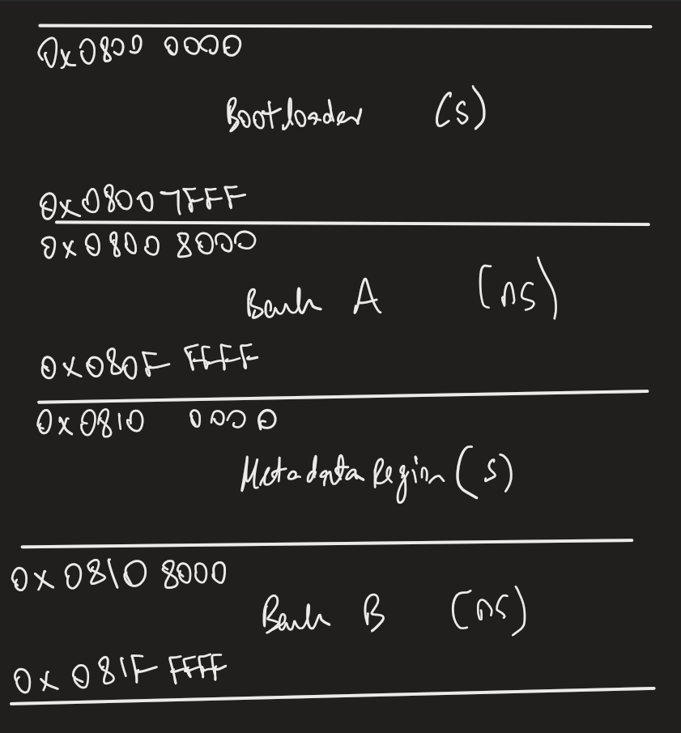
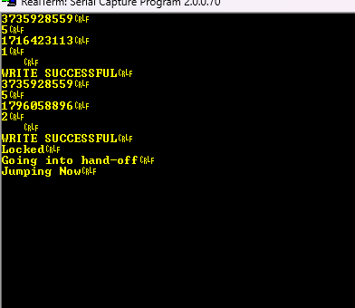

# stm32u5-secure-bootloader

# Flash Memory Layout

The bootloader targets the STM32U585 (2 MB embedded flash, dual-bank,
1 MB per bank). The layout below is fixed at design time and every boundary
is chosen to satisfy a specific hardware constraint or update-scheme
requirement.

## Regions

| Region            | Base address  | Size   | Bank | S/NS (TZEN=1 plan) | Justification |
|-------------------|---------------|--------|------|--------------------|---------------|
| Bootloader / RoT  | `0x0800_0000` | 32 KB  | 1    | Secure (S)         | Placed at the Bank 1 base because the CPU boots from `0x0800_0000` by default; the root of trust must be the first code the core fetches. 32 KB = 4 pages is a large enough starting allocation |
| Slot A            | `0x0800_8000` | 992 KB | 1    | Non-secure (NS)    | Occupies the remainder of Bank 1 after the bootloader. Size follows from the bank boundary: `0x080F_FFFF − 0x0800_8000 + 1` |
| Metadata          | `0x0810_0000` | 32 KB  | 2    | Secure (S)         | Placed at the Bank 2 base, in a different bank from the executing bootloader, to avoid the same-bank read-while-write stall (RM0456: a program/erase to a bank stalls reads to that same bank). Keeping metadata in Bank 2 lets the bootloader run from Bank 1 while metadata is updated. |
| Slot B            | `0x0810_8000` | 992 KB | 2    | Non-secure (NS)    | Mirrors Slot A's size exactly so an image is bit-for-bit relocatable between slots. Same 32 KB offset from the bank base as Slot A has from its bank base |

## Why Slot A and Slot B live in separate banks

A/B updates require writing the inactive slot while the active slot runs.
On this part, a program or erase to a flash bank stalls the bus for any
read to that same bank (RM0456, embedded flash memory chapter).
Cross-bank fetches are unaffected. Splitting the two slots across Bank 1
and Bank 2 means the metadata update path (Bank 2) never stalls
bootloader instruction fetches (Bank 1), and the dual-bank symmetry keeps
the two slots identically sized so an image relocates between them without
re-linking.

## Deriving the sizes

- **Page size: 8 KB**, 128 pages per bank (RM0456 Table 52). Cross-checked:
  128 × 8 KB = 1 MB per bank × 2 banks = 2 MB total, matching the part's
  flash size.
- **Bank boundaries** (RM0456): Bank 1 = `0x0800_0000`–`0x080F_FFFF`,
  Bank 2 = `0x0810_0000`–`0x081F_FFFF`.
- **Bootloader end**: `0x0800_0000 + 0x8000 − 1 = 0x0800_7FFF` (32 KB).
- **Slot A**: `0x0800_8000`–`0x080F_FFFF` = 992 KB.
- **Slot B**: `0x0810_8000`–`0x081F_FFFF` = 992 KB (symmetric with Slot A).

## Programming and erase constraints (RM0456, 7.3.7 / 7.3.6)

- **Program granularity**: 137 bits per write. 128 bits of data plus 9 ECC
  bits computed by the hardware over the full 128-bit word. Software can
  only program a full quad-word (4 × 32-bit). Therefore, we use 128 bits as the 
  software boundary.
- **Bit direction**: programming clears bits (1->0) only. Restoring a bit to 1
  requires erasing the whole page.
- **Erase granularity**: one page = 8 KB. There is no sub-page erase, which
  is the constraint the log-structured metadata format is designed around.
- **Alignment**: the first word of a quad-word must sit on a 16-byte-aligned
  address (`low 4 bits must be 0`), or the program is rejected (PGAERR).

## TrustZone-aware layout (TZEN currently 0)

TrustZone-M is not enabled in silicon yet (that is Phase 3), but the region
split is chosen so the secure/non-secure boundary is already sensible: the
bootloader/RoT and metadata are marked Secure, the two application slots
Non-secure. Because the S/NS split falls on existing region boundaries
rather than cutting through a region, enabling TZEN later does not require
moving any region.

## Verified on hardware

The flash driver was validated on the B-U585I-IOT02A: unlock, page erase,
quad-word program, ICACHE-invalidated read-back, and the error paths
(PGAERR on an unaligned address, PROGERR on an un-erased write) were each
reproduced deliberately. The capture below closes Phase 1.

